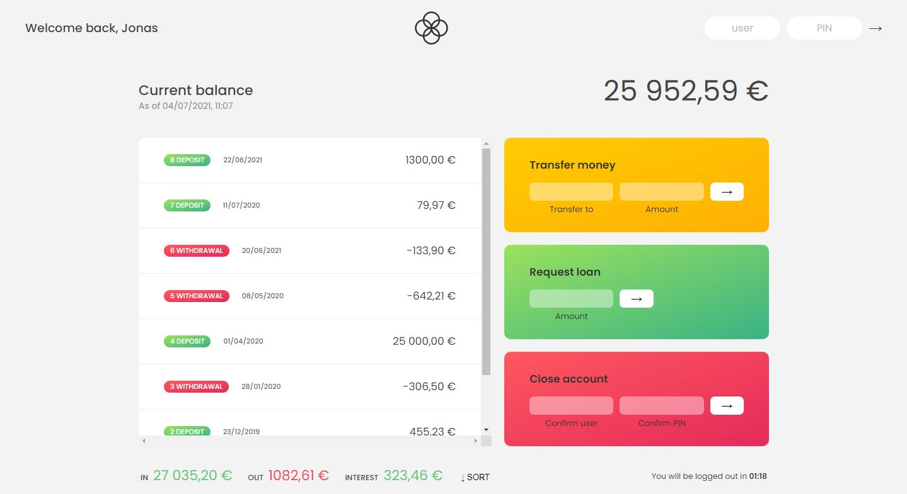

## **<h2 align="center">Front end application  💻</h2>**

# 💸 Banskist

<h1 align="center">
    
</h1>

# Important
## :key: How to Login

User : js  
Password : 1111

User : jd  
Password : 2222

---

:key: Take a look --> https://chammounc.github.io/Bankist/

## :rocket: Technologies used:

---

## ⭐ Features
- [x] Login, Logout
- [x] Transfer money
- [x] request loan
- [x] close account
## Rules

---

## About

This project was developed in The Complete JavaScript Course 2021: From Zero to Expert! course 
https://www.udemy.com/course/the-complete-javascript-course/

Created by **Jonas Schmedtmann**  
Developed by **Chammoun Chakhap**
